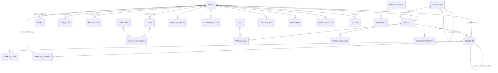

# ERD — Portal News (MySQL)

> Bản đồ quan hệ dữ liệu, kèm: `database/schema.sql` (DDL) · `database/seed.sql` (dữ liệu mẫu) · `docs/API.md` (API).

## 1. Sơ đồ tổng thể (Mermaid)



## 2. Bảng chi tiết theo nhóm

### Nhóm A — Auth & RBAC
| Bảng | Khóa | FK | Ghi chú |
|---|---|---|---|
| `roles` | PK `id`, UK `code` | — | ADMIN/EDITOR/AUTHOR/SUBSCRIBER |
| `permissions` | PK `id`, UK `key_name` | — | 8 quyền tĩnh |
| `role_permissions` | PK(`role_id`,`permission_id`) | → roles, permissions | ma trận RBAC |
| `users` | PK `id`, UK `email` | → roles | status ACTIVE/BLOCKED |
| `refresh_tokens` | PK `id` | → users | token_hash SHA-256 |
| `password_resets` | PK `id` | → users | hạn 15 phút |

### Nhóm B — Nội dung
| Bảng | Khóa | FK | Ghi chú |
|---|---|---|---|
| `categories` | PK `id`, UK `slug` | → categories (`parent_id`) | cây nhiều cấp |
| `tags` | PK `id`, UK `slug` | — | |
| `articles` | PK `id`, UK `slug`, FULLTEXT(title,excerpt) | → categories, users | status 6 giá trị, soft delete |
| `article_tags` | PK(`article_id`,`tag_id`) | → articles, tags | N-N |
| `article_revisions` | PK `id` | → articles, users | GĐ2 |

### Nhóm C — Community
| Bảng | Khóa | FK | Ghi chú |
|---|---|---|---|
| `comments` | PK `id` | → articles, users, comments×2 | `parent_id` (gốc/lồng), `reply_to_id` (trả lời ai) |
| `comment_likes` | PK(`comment_id`,`user_id`) | → comments, users | |
| `article_likes` | PK(`article_id`,`user_id`) | → articles, users | |
| `bookmarks` | PK(`user_id`,`article_id`) | → users, articles | Bài đã lưu |
| `reading_history` | PK `id`, UK(`user_id`,`article_id`) | → users, articles | 1 dòng/user+article, update `read_at` |
| `follows` | PK(`follower_id`,`author_id`) | → users ×2 | theo dõi tác giả |
| `comment_reports` | PK `id`, UK(`comment_id`,`reporter_id`) | → comments, users | mỗi người báo cáo 1 lần |

### Nhóm D — Hệ thống & quản trị
| Bảng | Khóa | FK | Ghi chú |
|---|---|---|---|
| `notifications` | PK `id` | → users | type COMMENT/LIKE/SYSTEM |
| `media` | PK `id` | → users | file vật lý ở `Uploads/` |
| `menu_items` | PK `id` | — | location HEADER/FOOTER + position |
| `advertisements` | PK `id` | — | views/clicks tổng hợp |
| `ad_events` | PK `id` | → advertisements | log VIEW/CLICK từng lần |
| `settings` | PK `` `key` `` | — | key-value, scope PUBLIC/ADMIN |
| `audit_logs` | PK `id` | → users (SET NULL) | status SUCCESS/WARNING/FAILED |
| `contact_messages` | PK `id` | — | form Liên hệ |
| `article_stats_daily` | PK(`article_id`,`stat_date`) | → articles | dữ liệu biểu đồ analytics |

## 3. Luồng dữ liệu chính (backend flows)

```text
ĐỌC BÀI (public)
  GET /api/articles/home ──► articles(status=PUBLISHED) ──► ArticleCard[]
  GET /api/articles/:slug ─► articles + categories + users + tags
                          └─► related (cùng category) + popular (views DESC)

DUYỆT BÀI (RBAC)
  AUTHOR: POST /api/articles (action=SUBMIT) ─► status=PENDING
  EDITOR/ADMIN: POST /:id/approve ─► PUBLISHED + published_at + notification(SYSTEM)
                POST /:id/reject  ─► REJECTED + reject_reason + notification(SYSTEM)
  (mọi thao tác ─► audit_logs)

BÌNH LUẬN
  POST comment ─► comments + comments_count++ + notification(COMMENT)
  báo cáo      ─► comment_reports(PENDING) ─► admin xử lý
                  ─► comments.status = HIDDEN | cascade DELETE ─► audit_logs

TƯƠNG TÁC ĐỘC GIẢ
  like/bookmark/follow ─► article_likes / bookmarks / follows
  mở bài               ─► articles.views++ + article_stats_daily(views)++
                          + reading_history upsert

HỆ THỐNG
  Scheduled job (cron/event) ─► articles SCHEDULED → PUBLISHED khi đến scheduled_at
  maintenance_mode=true       ─► middleware trả 503 cho endpoint public
```

## 4. Nguyên tắc thiết kế đã áp dụng

1. **Đếm sẵn (`likes_count`, `views`, `comments_count`)** trên `articles`/`comments` → danh sách không cần `COUNT(*)` mỗi request; đồng bộ bằng transaction khi like/comment.
2. **Soft delete** cho `articles.deleted_at` (giữ SEO/link cũ), **hard delete** cho comment.
3. **Denormalize nhẹ** `author.name/avatar` trong response (JOIN 1 lần) thay vì lưu trùng trong bảng.
4. **FULLTEXT** trên `articles(title, excerpt)` cho tìm kiếm (kèm cấu hình `innodb_ft_min_token_size` nhỏ cho tiếng Việt, hoặc fallback `LIKE`).
5. **UNIQUE** `uk_report_once` chống spam báo cáo; `uk_rh_user_article` chống trùng lịch sử đọc.
6. **ON DELETE** hợp lý: CASCADE với bảng phụ (tags/likes/media...), SET NULL với `audit_logs.user_id` (giữ log kể cả user bị xóa).
7. **Kiểu ID thống nhất BIGINT UNSIGNED** — tránh trộn INT/BIGINT khi JOIN (lỗi im lặng phổ biến của MySQL).

